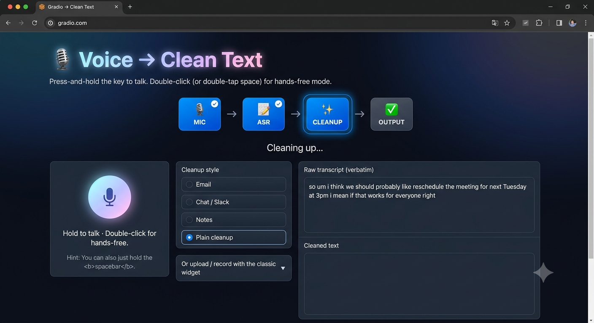

# 🎙️ Wispr Flow Clone

title: Wispr Flow Clone
emoji: 🎙️
colorFrom: blue
colorTo: indigo
sdk: gradio
sdk_version: 6.26.0
python_version: "3.10"
app_file: app.py
pinned: false

A voice-to-text writing assistant inspired by Wispr Flow.

The pipeline uses two Hugging Face models:

- **ASR:** [`aijadugar/wisprflow-clone-whisper`](https://huggingface.co/aijadugar/wisprflow-clone-whisper)
- **LLM:** [`aijadugar/wisprflow-clone-llm`](https://huggingface.co/aijadugar/wisprflow-clone-llm)


# Voice → Clean Text

A Wispr Flow-style pipeline: speak, get a verbatim transcript, then a
cleaned-up version with filler words removed and tone adapted to your
chosen mode (email / chat / notes).

## How it's wired

- **ASR (fine-tuned Whisper)** — transcribes audio **verbatim**. It does
  not rewrite content; its only job is faithful transcription, including
  disfluencies. This matters: a dictation tool that "corrects" during
  transcription can silently put words in your mouth.
- **Cleanup (fine-tuned LLM)** — takes the verbatim transcript and
  rewrites it: removes filler words and false starts, fixes grammar,
  adapts tone to the selected mode. All rewriting happens here, where
  it's visible and controlled by an explicit system prompt.

## Running locally

```bash
pip install -r requirements.txt
export WHISPER_REPO_ID="aijadugar/wispr-clone-whisper"
export LLM_REPO_ID="aijadugar/wispr-clone-llm"
python app.py
```

Or just edit the default repo IDs at the top of `app.py`.

## Deploying as a Hugging Face Space

1. Create a new Space (SDK: Gradio).
2. Push `app.py`, `requirements.txt`, and this `README.md`.
3. Set `WHISPER_REPO_ID` / `LLM_REPO_ID` as Space variables (Settings →
   Variables), or hardcode them in `app.py`.
4. Pick a GPU hardware tier if you want low-latency generation — CPU
   works but the LLM stage will be noticeably slower.

## Training

The models this app loads are produced by the companion training
notebook (`wf-voice-to-clean-text.ipynb`), designed to run on Kaggle's
free T4×2 GPU quota. See that notebook for the full fine-tuning + Hub
push pipeline.
